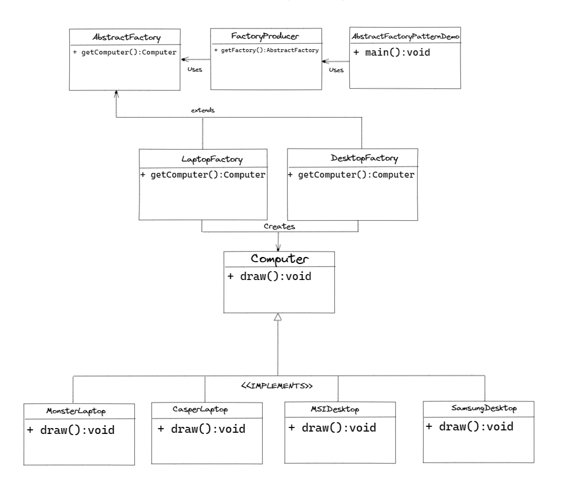

## :heavy_check_mark: Abstract Factory Method

**Abstract Factory Method Tasarım Deseni, Creational (Yaratımsal) Tasarım Desenleri kategorisinde yer alan bir tasarım desenidir. Bu tasarım deseni, nesne yaratım işlemlerini soyutlaştırmayı amaçlar ve nesnelerin yaratım sürecinde kullanılan sınıfların somut sınıflarının ayrıntılarından bağımsız hale gelmesini sağlar.**

**Bu tasarım deseni, birbiriyle ilgili birden fazla nesne ailesinin yaratımını gerçekleştirmek için kullanılır. Bir nesne ailesi, birbirleriyle ilgili olan nesnelerin bir grubudur. Örneğin, bir araba fabrikası bir nesne ailesi olarak düşünülebilir. Bu nesne ailesi, motor, şanzıman, frenler gibi birbirleriyle ilişkili parçalardan oluşur.**

**Abstract Factory Method Tasarım Deseni, nesne yaratım sürecinde soyut fabrika sınıfları kullanır. Bu soyut fabrika sınıfları, birbirleriyle ilgili olan birden fazla nesne ailesinin yaratımını gerçekleştiren somut fabrika sınıflarının arayüzlerini tanımlar. Somut fabrika sınıfları, birbirleriyle ilgili olan somut nesne sınıflarını yaratmak için soyut fabrika sınıflarını uygularlar.**

