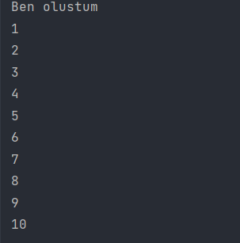

#### App sınıfında for döngüsü yapmamıza rağmen tek bir defasında yapıcı (constructer) tarafına giderek nesnesini oluşturur ve "Ben olustum" yazısını yazar ama count değişkenini her defasında tekrar artırır.

